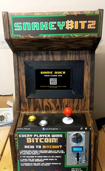

## SnakeyBitz
Created: October 11th 2022 • By: Jared Holitskii

### Intro
SnakeyBitz is an exciting Bitcoin ATM disguised as an 80's arcade game. There's also a splash of VLTs mixed in. This project is intended to introduce millennials to Bitcoin and Lightning Network through retro games found in bars, social gatherings, and other locations. 

Whenever a player inserts a coin, they are rewarded with SATS based on their score in the classic Snake game. The game features different colored foods that contain different amounts of SATS. The statistical probabilities of higher value foods are lower than the lower value foods. The overall probability model of the game is based on VLTs, where the majority of the time, the player ends up with less SATS than the fiat amount they put in the machine. A small fraction of the time, the player walks away with more BTC than the fiat value of the quarter. See pitch deck

  

### Build
Snakeybitz V1 has been built using open source parts and software. The game only accepts quarters for now to keep the game mechanics balanced in its simplest form. go

There are Three Main Components:
1. BTC Lightning Payment Rails
    - built off of LNBits (https://github.com/lnbits/lnbits.git)
    - Currently running off of legend, the centralized lnbits hosted. 
    - Goal is for self custody node, with sufficient liquidity for a large volume of transactions.

2. Arcade Game Cabinet
    - Raspberry Pi Zero flashed to current OS
    - 3/4 plywood custom built cabinet
    - Coin reader internally programmed for 1 coin (Canadian quarter)
    - Adafruit Trinket Mo to process signal from Coin Reader and send via serial
    - Joystick and buttons are remapped to keyboard keys within pygame and called via GPIO pins
    - Custom Decals in memory of retro Arcade games

3. Game Engine
    - Python pygame based "snake"
    - Statistically variable "foods", creates VLT aspect of game
    - Pull unique score based QR codes into GAMEOVER screen, created on lnbits and retrived to pygame
    - Highscore entry system

### Bugs
- replay when yellow button is pressed in gameover screen
- joymap class wont let the bouce time variable be change, making the highscore screen hard to use.

### Parts
- Raspi 4
- 1Tb hard drive and raspi-blitz installed
- 3D printed case
- 3.5 inch tft screen
- Joystick
- Two buttons
- Through hole solderable breadboard
- Various wire
- Extra tall male to female header 13x2

### Dependancies
- Pygame: pip install pygame, sudo apt-get install git curl libsdl2-mixer-2.0-0 libsdl2-image-2.0-0 libsdl2-2.0-0 
- Evdev: sudo pip3 install evdev, sudo apt install libsdl2-ttf-2.0-0 

### Future Features
- Tip the house: player has the option to tip the house (the current social establishment). Where the house has a lightning wallet that the servers/owners retirvie at the end of the night. 
- Other games (bitvaders, bitris, Platformer, flappybit)
- DOS like interface to choose different games
- Player ID's 

### Feature Requests
- Order a beer and pay through lightning